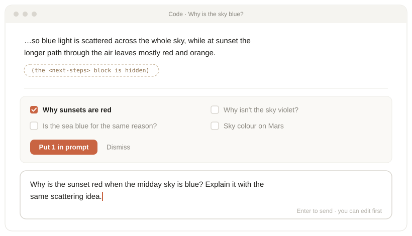
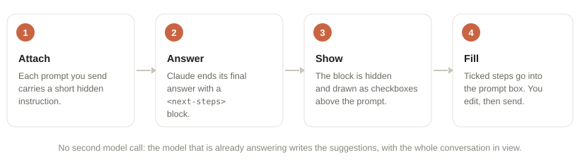

<div align="center">

# claude-mods

**Mods for [Claude Code](https://code.claude.com/docs/en/plugins/mods/overview): plugins that run inside Claude Code and draw in its interface.**

[](LICENSE)
[](https://code.claude.com/docs/en/plugins/mods/overview)


[English](#inline-next-steps) · [中文说明](#中文说明)

</div>

## inline-next-steps

Claude ends each answer with a few things you might ask next. They show up as checkboxes above the prompt. Tick one or more, and they go into the prompt box for you to edit and send.

<p align="center">
  
  <br>
  <sub>Illustration of the Claude Code desktop app with the mod on.</sub>
</p>

- **No extra model calls.** The model that is already answering writes the suggestions, with the whole conversation in view.
- **Nothing is sent for you.** Ticked steps are put in the prompt box; you edit and press Enter.
- **Work or questions.** 2 to 6 concrete next steps after a task; 1 to 3 follow-up questions after a plain question.
- **Stays out of the way.** The raw block is hidden from the transcript, and nothing is attached where the mod can't draw buttons.

### Install

Requires Claude Code with mods support (v2.1.286 or later).

```bash
claude plugin marketplace add shijieli708-ship-it/claude-mods
claude plugin install inline-next-steps@claude-mods
```

Then start a new session, or run `/reload-plugins` in an open one.

### How it works

<p align="center">
  
</p>

1. **Attach**: each prompt you send carries a short instruction you don't see, asking Claude to end its final answer with a `<next-steps>` block. Each line is `short label | the full request`.
2. **Answer**: Claude writes the block at the end of its final answer, never in progress notes between tool calls or in a subagent.
3. **Show**: the block is removed from how the reply is drawn and becomes checkboxes in the band above the prompt. The stored conversation is left untouched, so the model's thinking blocks stay valid.
4. **Fill**: the ticked requests go into the prompt box, numbered if there are several.

### Cost

Each turn costs roughly 100 extra output tokens for the block and about 250 input tokens for the instruction, which is cached afterwards. Mods that ask a second model for suggestions after each turn pay for re-reading the conversation, and see only part of it.

### Limits

- The model may now and then leave the block out or write it in a different shape; that turn simply shows no buttons.
- Instructions are attached only where the mod can draw: the terminal and the desktop app. Elsewhere (the VS Code chat panel, `claude -p`) nothing is attached, so no raw block appears.
- While a reply streams in, the block is hidden as soon as its opening tag arrives.

## Writing your own

Each mod is a plugin directory under `plugins/` with `.claude-plugin/plugin.json`, `hooks/hooks.json` and a hooks module. See the [mods documentation](https://code.claude.com/docs/en/plugins/mods/overview). Check a mod before loading it with:

```bash
claude plugin validate plugins/<mod>
```

## License

[MIT](LICENSE)

---

## 中文说明

### inline-next-steps

Claude 在每次回答的末尾列出几条你接下来可能会问的事情，以复选框的形式显示在输入框上方。勾选一条或几条后，它们会被填进输入框，你可以先修改，确认后再发送。

- **不额外调用模型**：建议由正在回答的模型顺便写出，它能看到完整的对话。
- **不会替你发送**：勾选的内容只是填进输入框，由你修改后按回车发送。
- **做事和问答都适用**：完成任务后给出 2–6 个具体的下一步；回答普通问题后给出 1–3 个延伸问题。
- **不打扰**：原始的建议块在对话里是隐藏的；在无法显示按钮的地方，也不会附加说明。

**安装**

```bash
claude plugin marketplace add shijieli708-ship-it/claude-mods
claude plugin install inline-next-steps@claude-mods
```

然后新开一个会话，或者在已打开的会话里运行 `/reload-plugins`。

**原理**

1. **附加说明**：你每发一条消息，mod 会附上一段你看不到的简短说明，让 Claude 在最终回答末尾写一个 `<next-steps>` 块，每行格式是 `短标签 | 完整指令`。
2. **回答**：Claude 只在最终回答里写这个块，工具调用之间的进度说明和子 agent 里都不会写。
3. **显示**：这个块只从界面显示上去掉，变成输入框上方的复选框。存储的对话记录不动，所以模型的思考块依然有效。
4. **填入**：勾选的内容会填进输入框，多条会自动编号。

**成本**：每轮大约多 100 个输出 token，外加约 250 个输入 token 的说明，这部分之后会被缓存。如果改用第二个模型在每轮结束后生成建议，就得把对话重新读一遍，而且只能看到其中一部分。

**局限**：模型偶尔会漏写这个块或写错格式，这一轮就不会出现按钮。在 VS Code 聊天面板和 `claude -p` 里不会附加说明，所以也不会出现块的原文。回答逐字输出时，块的开头标签一出现就会被隐藏。
